# LifeOS — Meta & Instagram Graph API Setup Guide (Stage 6A)

This document provides step-by-step instructions for creating and configuring a **Meta Developer Application** to enable official Instagram publishing, insights, and account management within the LifeOS Social Media Hub.

---

## 1. Overview & Architecture

Meta provides the **Instagram Graph API** to allow third-party applications to publish media (Reels, Photos, Carousel posts, Videos), retrieve engagement metrics, and manage Instagram accounts.

```mermaid
flowchart LR
    A[LifeOS Frontend] -->|1. Connect Instagram| B[Flask Backend]
    B -->|2. Generate OAuth State & Auth URL| C[Meta OAuth Dialog]
    C -->|3. User Grants Permissions| B
    B -->|4. Exchange Code for User Token| D[Meta Graph API]
    D -->|5. Exchange for Long-Lived Token| D
    D -->|6. Query Linked Pages & IG Accounts| D
    B -->|7. Encrypt Token & Store in DB| E[(PostgreSQL)]
```



### Key Integration Concepts
1. **User Token vs. Page Token**: Authorization begins with a Meta User Access Token, which is exchanged for long-lived tokens and used to discover connected Facebook Pages and their linked Instagram Business/Creator accounts.
2. **Account Requirement**: Only **Instagram Professional Accounts** (Business or Creator) linked to a **Facebook Page** can publish content and read analytics via the Graph API. Personal Instagram accounts are not supported by Meta's Graph API.

---

## 2. Meta Developer App Setup (Step-by-Step)

### Step 1: Register as a Meta Developer
1. Go to the [Meta for Developers Portal](https://developers.facebook.com/).
2. Log in with your Facebook credentials.
3. If you do not have a developer account, click **Get Started** and complete the verification process (SMS or phone verification).

### Step 2: Create a Meta Developer App
1. Navigate to [My Apps](https://developers.facebook.com/apps/).
2. Click **Create App** (green button).
3. Select an App Use Case / Type:
   - For complete business workflows (Pages + Instagram Publishing), select **Other** > **Business**, or choose **Authenticate and request data from users with Facebook Login**.
4. Configure App Details:
   - **App Name**: `LifeOS` (or `LifeOS-Dev`)
   - **App Contact Email**: Your development contact email
   - **Business Account**: Select your Meta Business Account if available (or create one).
5. Click **Create App** and complete the security check.

### Step 3: Add Required Products to Your App
In the Meta App Dashboard left navigation / product catalog:
1. Locate **Facebook Login for Business** (or **Facebook Login**) and click **Set Up**.
2. Locate **Instagram Graph API** (if listed separately in your App type) and click **Set Up**.

### Step 4: Configure OAuth Settings & Redirect URIs
1. In the left navigation menu, go to **Facebook Login** > **Settings** (or **App settings** > **Advanced**).
2. Under **Client OAuth Settings**:
   - Enable **Client OAuth Login**: `Yes`
   - Enable **Web OAuth Login**: `Yes`
   - Enable **Enforce HTTPS**: `Yes` *(Note: `localhost` and `127.0.0.1` are automatically allowed exceptions during development)*
3. In **Valid OAuth Redirect URIs**, enter the exact LifeOS backend callback URLs:
   ```text
   http://localhost:5000/api/social-media/oauth/instagram/callback
   http://localhost:5000/api/social-media/oauth/meta/callback
   ```
4. Click **Save Changes** at the bottom of the page.

> [!WARNING]
> The redirect URI configured in the Meta Developer Dashboard must match the `INSTAGRAM_REDIRECT_URI` in `backend/.env` **exactly**. Any mismatch (protocol, port, path, or trailing slash) will result in a `redirect_uri_mismatch` error from Meta.

---

## 3. Required Permissions & OAuth Scopes

LifeOS requires specific permissions to discover accounts, upload media containers, and publish posts.

| Permission / Scope | Type | Purpose in LifeOS |
| :--- | :--- | :--- |
| `instagram_basic` | Standard / Advanced | Reads basic Instagram account info (Username, Account ID, Profile Picture). |
| `instagram_content_publish` | Standard / Advanced | Creates media containers and publishes single photos, reels, videos, and carousel items. |
| `pages_show_list` | Standard / Advanced | Lists Facebook Pages managed by the authenticated user to discover attached Instagram Professional accounts. |
| `pages_read_engagement` | Standard / Advanced | Reads page details required for Graph API traversal and verification. |
| `business_management` | Standard / Advanced | Manages assets and enables discovery of Instagram accounts inside Meta Business Manager. |
| `instagram_manage_insights` | Standard / Advanced *(Optional / Analytics)* | Retrieves media engagement, impressions, reach, and follower insights snapshots. |
| `instagram_manage_comments` | Standard / Advanced *(Optional / Engagement)* | Reads and responds to post comments (if comment moderation is enabled). |

---

## 4. Instagram Account & Facebook Page Prerequisites

To connect an Instagram account to LifeOS and publish content, the Instagram account **must meet two requirements**:

### Prerequisite A: Convert Personal Account to Professional (Creator or Business)
Personal Instagram accounts do not support API publishing. To switch:
1. Open the **Instagram mobile app** on your smartphone.
2. Go to your Profile > tap the Menu icon (three lines) > **Settings and privacy**.
3. Scroll to **Account type and tools** (or **For professionals**).
4. Tap **Switch to professional account**.
5. Select either **Creator** (ideal for individual content creators) or **Business** (ideal for brands).
6. Complete the category selection and profile setup.

### Prerequisite B: Link Instagram Professional Account to a Facebook Page
Meta's Graph API routes Instagram publishing through the connected Facebook Page.
1. Open [Facebook](https://www.facebook.com/) on desktop and navigate to your **Pages**.
   - If you do not have a Facebook Page, click **Create new Page** (e.g., matching your brand/channel name).
2. Go to your **Facebook Page Settings**:
   - Open your Page > Click **Settings & privacy** > **Settings**.
3. In the left sidebar, click **Linked Accounts**.
4. Select **Instagram** and click **Connect Account**.
5. Log in with your Instagram Professional account credentials and confirm the connection.
6. Toggle **Allow access to Instagram messages in Inbox** (optional) and click **Confirm**.

> [!IMPORTANT]
> **Verification Tip**: Open [Meta Business Suite](https://business.facebook.com/) and verify that both your Facebook Page and Instagram Account appear together under your Business Assets.

---

## 5. Local Environment Configuration

Add the following variables to your local `backend/.env` file:

```env
# ==============================================================================
# Meta & Instagram Graph API Configuration
# ==============================================================================

# 1. Meta App ID (From App Dashboard -> Settings -> Basic -> App ID)
INSTAGRAM_CLIENT_ID=your_meta_app_id_here
META_APP_ID=your_meta_app_id_here

# 2. Meta App Secret (From App Dashboard -> Settings -> Basic -> App Secret)
INSTAGRAM_CLIENT_SECRET=your_meta_app_secret_here
META_APP_SECRET=your_meta_app_secret_here

# 3. Instagram Redirect URI (Backend OAuth Callback)
INSTAGRAM_REDIRECT_URI=http://localhost:5000/api/social-media/oauth/instagram/callback
META_REDIRECT_URI=http://localhost:5000/api/social-media/oauth/meta/callback

# 4. Meta Graph API Version (Do not hardcode versions)
META_GRAPH_API_VERSION=v21.0

# 5. Meta Graph API Base URL
META_GRAPH_API_BASE_URL=https://graph.facebook.com

# 6. OAuth Requested Scopes
INSTAGRAM_SCOPES=instagram_basic,instagram_content_publish,pages_show_list,pages_read_engagement,business_management
```

> [!CAUTION]
> **Security Mandate**: 
> - Never expose `INSTAGRAM_CLIENT_SECRET` or `META_APP_SECRET` to the frontend or version control.
> - Access tokens received from Meta are encrypted using the application's Fernet `ENCRYPTION_KEY` before saving to PostgreSQL.

---

## 6. Development vs. Live Mode (Meta App Review)

### Development Mode (Default)
- While in **Development Mode**, only users with an explicit role on your Meta App can authenticate and use the integration.
- To authorize your personal Facebook/Instagram account during development:
  1. In the Meta App Dashboard, go to **App Roles** > **Roles**.
  2. Under **Developers** or **Testers**, click **Add Developers** / **Add Testers**.
  3. Enter your Facebook account username or ID and accept the invitation on Facebook.
  4. For Instagram testers: Go to **Instagram** > **Basic Display** or **Roles** > **Instagram Testers** and add your Instagram handle.

### Live Mode & App Review (Production)
- To allow arbitrary external users to connect their Instagram accounts, the app must be switched to **Live Mode**.
- Switching to Live Mode requires submitting permissions (`instagram_basic`, `instagram_content_publish`, `pages_show_list`, `pages_read_engagement`) for **Meta App Review**, including:
  1. Providing a screencast video demonstrating how the permissions are used inside LifeOS.
  2. Providing a privacy policy URL and terms of service URL.
  3. Completing Meta Business Verification.

---

## 7. Troubleshooting & Common Pitfalls

| Issue / Error | Cause | Resolution |
| :--- | :--- | :--- |
| `redirect_uri_mismatch` | Configured redirect URI does not match Meta Dashboard. | Ensure `INSTAGRAM_REDIRECT_URI` matches exactly with the entry under **Facebook Login** > **Settings** > **Valid OAuth Redirect URIs**. |
| `No linked Instagram account found` | The Facebook Page is not linked to an Instagram Professional account. | Go to Facebook Page Settings > Linked Accounts > Connect Instagram. Ensure account is Creator or Business type. |
| `(#10) Application does not have permission` | App is in Development mode and user is not an App Developer/Tester. | Add the user under **App Roles** > **Roles** in the Meta Developer Dashboard. |
| `Invalid OAuth access token signature` | Meta App Secret mismatch or token corrupted. | Verify `INSTAGRAM_CLIENT_SECRET` in `backend/.env` matches the Meta Dashboard Basic settings. |

---

## 8. Next Steps (Stage 6B)

With configuration and setup guidelines in place:
1. **Stage 6B**: Implement backend OAuth initiation, state generation, callback token exchange, and account persistence in `social_accounts`.
2. **Stage 6C**: Implement Instagram container creation and media publishing (Reels / Single Post / Carousel) via Meta Graph API.
