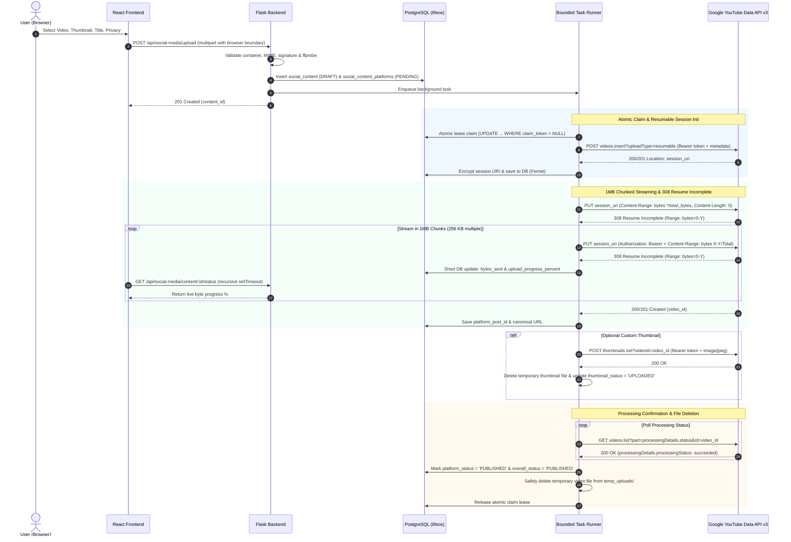

# LifeOS — YouTube End-to-End Resumable Publishing Guide (Phase 6 Hardened)

This document explains the technical architecture, official protocols, lifecycle rules, concurrency protections, error recovery, and manual testing procedures for the LifeOS YouTube Video & Shorts Publishing MVP.

---

## 1. OAuth Scopes & Permission Upgrade

Phase 6 upgrades LifeOS permissions to enable official video publishing:

| Scope | Purpose | Status |
|---|---|---|
| `https://www.googleapis.com/auth/youtube.readonly` | View channel title, handle, subscriber stats, and avatar | Maintained |
| `https://www.googleapis.com/auth/youtube.upload` | Upload and publish videos and set custom video thumbnails | **Added in Phase 6** |

> [!IMPORTANT]
> **One-Time Account Reconnection Required**:
> Accounts connected during Phase 5 (which granted only `youtube.readonly`) must be reconnected once. In the LifeOS UI (**Connected Accounts**), existing connections display a **"Reconnect for Uploads"** badge. Clicking **Reconnect** prompts Google's OAuth consent screen with both scopes.

---

## 2. Resumable Upload Architecture & Lifecycle

LifeOS uses the official Google YouTube Data API v3 `videos.insert?uploadType=resumable` protocol:

---

## 3. Concurrency Protection & Atomic Job Claiming

1. **Database-Backed Lease**: Uses `claim_token VARCHAR(64)` and `claim_expires_at TIMESTAMP WITH TIME ZONE` in `social_content_platforms`.
2. **Conditional Atomic Updates**: `UPDATE social_content_platforms SET claim_token = %s, claim_expires_at = ... WHERE id = %s AND (claim_expires_at IS NULL OR claim_expires_at < CURRENT_TIMESTAMP OR claim_token = %s) AND platform_post_id IS NULL RETURNING id;`
3. **No Duplicate `videos.insert`**: Once a `platform_post_id` (YouTube Video ID) exists, `videos.insert` is never called again for that post.
4. **Zero Open Connections During Network**: Database connections and cursors are committed and closed immediately before any HTTP calls or backoff sleeps.
5. **Bounded ThreadPoolExecutor**: Unbounded daemon threads are replaced with a configurable, bounded `ThreadPoolExecutor(max_workers=Config.YOUTUBE_PUBLISH_MAX_WORKERS)`.
6. **Startup Task Recovery**: `recover_pending_youtube_tasks()` scans for interrupted `PENDING` / `PROCESSING` jobs upon server startup and resumes them cleanly.

---

## 4. Resilience, Exponential Backoff & 401 Refresh

* **Chunk Size**: Configured via `YOUTUBE_UPLOAD_CHUNK_SIZE_KB` (default: 1024 KB / 1 MB, positive multiple of 256 KB).
* **HTTP 401 Unauthorized**: Automatically triggers access token refresh through `get_valid_youtube_access_token(account_id, user_id, force_refresh=True)`, updates request headers, queries the acknowledged byte offset, and resumes without losing progress.
* **Transient Errors (429, 500, 502, 503, 504)**: Handled with exponential backoff and randomized jitter, strictly honoring `Retry-After` headers if returned by Google.
* **Monotonic Offset Validation**: Verifies that server-acknowledged byte ranges advance monotonically and satisfy `0 <= offset <= file_size`.

---

## 5. Temporary File Lifecycle & Deletion Rules

1. **User Machine Safety**: LifeOS **never** modifies or deletes the original video file on the user's Mac.
2. **Accurate Processing Semantics**:
   - `uploadStatus == "uploaded"`: Bytes accepted; video remains `PROCESSING` and temporary file is **retained**.
   - `uploadStatus == "processed"` or `processingDetails.processingStatus == "succeeded"`: Processing confirmed; post marked `PUBLISHED` and temporary video file is **deleted**.
   - `uploadStatus in ("failed", "rejected")` or `processingDetails.processingStatus in ("failed", "terminated")`: Post marked `FAILED` and file retained for retry.
3. **Independent Thumbnail Deletion**: Temporary thumbnails are deleted immediately after `thumbnails.set` succeeds, independent of video processing state.
4. **Physical Deletion Verification**: DB path references are cleared **only** if physical file removal succeeds. `temp_file_deleted = TRUE` is set only when both media and thumbnail paths are cleared.
5. **24-Hour Forced TTL**: Any temporary file older than 24 hours is purged automatically during background sweeper runs.

---

## 6. Manual Verification Walkthrough

1. **Verify Reconnect Prompt**:
   - Open `http://localhost:5173/social-media/accounts`.
   - If previously connected with read-only permissions, observe the **"Reconnect for Uploads"** badge.
   - Click **Reconnect** and approve the consent prompt to grant `youtube.upload`.
2. **Create and Publish Post**:
   - Navigate to **Create Post** (`/social-media/create`).
   - Select an MP4 video and an optional JPG/PNG thumbnail.
   - Enter a title (e.g. `LifeOS Omnichannel Publishing Demo`), description, and tags.
   - Set Privacy Status to `Private`.
   - Click **🚀 Publish Video to YouTube**.
3. **Observe Real-Time Pipeline Progress**:
   - Stage 1: Uploading to LifeOS Secure Storage (`0% - 100%`).
   - Stage 2: Queued for YouTube Resumable Upload.
   - Stage 3: Streaming to YouTube in Chunks (`0% - 100%`).
   - Stage 4: YouTube Processing & Confirmation.
   - Completion: Green banner with clickable **Watch on YouTube** link (`https://www.youtube.com/watch?v=...`).
4. **Inspect Post History**:
   - Open **Post History** (`/social-media/history`).
   - Confirm your post appears with `PUBLISHED` status, YouTube badge, date, and **Watch** action link.
5. **Inspect Dashboard**:
   - Open **Social Media Dashboard** (`/social-media/dashboard`).
   - Verify **Published Posts** and **In Progress** KPI counts reflect live database state.
